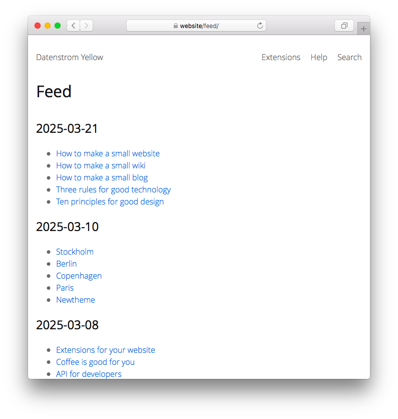

<p align="right"><a href="README-de.md">Deutsch</a> &nbsp; <a href="README.md">English</a> &nbsp; <a href="README-sv.md">Svenska</a></p>

# Feed 0.9.3

Feed mit letzten Änderungen.

<p align="center"></p>

## Wie man eine Erweiterung installiert

[ZIP-Datei herunterladen](https://github.com/annaesvensson/yellow-feed/archive/refs/heads/main.zip) und in dein `system/extensions`-Verzeichnis kopieren. [Weitere Informationen zu Erweiterungen](https://github.com/annaesvensson/yellow-update/tree/main/README-de.md).

## Wie man einen Feed benutzt

Der Feed ist auf deiner Webseite vorhanden als `http://website/feed/` und `http://website/feed/page:feed.xml`. Der erste Link ist ein menschenlesbarer Feed und der zweite Link ist ein maschinenlesbarer Feed, der gemeinhin als RSS-Feed bekannt ist. Es ist eine Liste der letzten Änderungen auf der gesamten Webseite, nur sichtbare Seiten sind enthalten.

Falls du nicht willst dass eine Seite sichtbar ist, kannst du `Status: unlisted` in den [Seiteneinstellungen](https://github.com/annaesvensson/yellow-core/tree/main/README-de.md#einstellungen-seite) ganz oben auf einer Seite festlegen.

## Wie man einen Feed anpasst

Falls du nicht die gesamte Webseite im Feed auflisten willst, kannst du unterschiedliche Filter benutzen um den Feed anzupassen. Du kannst auch die Definition von letzten Änderungen ändern. Um einen Blog-Feed zu machen, öffne die Datei `system/extensions/yellow-system.ini` und ändere `FeedRecentChanges: blog`. Um einen Wiki-Feed zu machen, öffne die Datei `system/extensions/yellow-system.ini` und ändere `FeedRecentChanges: wiki, wiki-start`. 

## Beispiele

Inhaltsdatei mit Link zum Feed:

    ---
    Title: Beispielseite
    ---
    Lorem ipsum dolor sit amet, consectetur adipisicing elit, sed do eiusmod tempor incididunt ut 
    labore et dolore magna pizza. Ut enim ad minim veniam, quis nostrud exercitation ullamco laboris 
    nisi ut aliquip ex ea commodo consequat. Duis aute irure dolor in reprehenderit in voluptate velit 
    esse cillum dolore eu fugiat nulla pariatur. Excepteur sint occaecat cupidatat non proident, sunt 
    in culpa qui officia deserunt mollit anim id est laborum.
    
    [Letzte Änderungen anzeigen](/feed/). 
    [RSS-Feed](/feed/page:feed.xml).

Inhaltsdatei mit Link zum Feed, von einem bestimmter Autor:

    ---
    Title: Beispielseite
    ---
    Lorem ipsum dolor sit amet, consectetur adipisicing elit, sed do eiusmod tempor incididunt ut 
    labore et dolore magna pizza. Ut enim ad minim veniam, quis nostrud exercitation ullamco laboris 
    nisi ut aliquip ex ea commodo consequat. Duis aute irure dolor in reprehenderit in voluptate velit 
    esse cillum dolore eu fugiat nulla pariatur. Excepteur sint occaecat cupidatat non proident, sunt 
    in culpa qui officia deserunt mollit anim id est laborum.
    
    [Letzte Änderungen von Datenstrom anzeigen](/feed/author:datenstrom/). 
    [RSS-Feed](/feed/author:datenstrom/page:feed.xml).

Inhaltsdatei mit Link zum Feed, für einen bestimmten Tag:

    ---
    Title: Beispielseite
    ---
    Lorem ipsum dolor sit amet, consectetur adipisicing elit, sed do eiusmod tempor incididunt ut 
    labore et dolore magna pizza. Ut enim ad minim veniam, quis nostrud exercitation ullamco laboris 
    nisi ut aliquip ex ea commodo consequat. Duis aute irure dolor in reprehenderit in voluptate velit 
    esse cillum dolore eu fugiat nulla pariatur. Excepteur sint occaecat cupidatat non proident, sunt 
    in culpa qui officia deserunt mollit anim id est laborum.
    
    [Letzte Änderungen für Beispiel anzeigen](/feed/tag:beispiel/). 
    [RSS-Feed](/feed/tag:beispiel/page:feed.xml).

Inhaltsdatei mit Link zum Feed, in einen bestimmten Verzeichnis:

    ---
    Title: Beispielseite
    ---
    Lorem ipsum dolor sit amet, consectetur adipisicing elit, sed do eiusmod tempor incididunt ut 
    labore et dolore magna pizza. Ut enim ad minim veniam, quis nostrud exercitation ullamco laboris 
    nisi ut aliquip ex ea commodo consequat. Duis aute irure dolor in reprehenderit in voluptate velit 
    esse cillum dolore eu fugiat nulla pariatur. Excepteur sint occaecat cupidatat non proident, sunt 
    in culpa qui officia deserunt mollit anim id est laborum.
    
    [Letzte Änderungen in Hilfe anzeigen](/feed/folder:help/). 
    [RSS-Feed](/feed/folder:help/page:feed.xml).

Layoutdatei mit Link zum Feed, in einen bestimmten Verzeichnis:

    <!DOCTYPE html>
    <html lang="<?php echo $this->yellow->page->getHtml("language") ?>">
    <head>
    <title><?php echo $this->yellow->page->getHtml("titleHeader") ?></title>
    <meta charset="utf-8" />
    <meta name="description" content="<?php echo $this->yellow->page->getHtml("description") ?>" />
    <meta name="author" content="<?php echo $this->yellow->page->getHtml("author") ?>" />
    <meta name="generator" content="Datenstrom Yellow" />
    <meta name="viewport" content="width=device-width, initial-scale=1" />
    <?php echo $this->yellow->page->getExtraHtml("header") ?>
    <link rel="alternate" type="application/rss+xml" href="<?php echo $this->yellow->page->getBase(true)."/feed/folder:help/page:feed.xml" ?>" title="<?php echo "Hilfe - ".$this->yellow->page->getHtml("sitename") ?>" />
    </head>
    ...

Verschiedene Filter in den Einstellungen festlegen:

```
FeedRecentChanges: auto
FeedRecentChanges: blog
FeedRecentChanges: blog, podcast, stream
FeedRecentChanges: wiki, wiki-start
```

## Einstellungen

Die folgenden Einstellungen können in der Datei `system/extensions/yellow-system.ini` vorgenommen werden:

`FeedLocation` = Ort des Feed  
`FeedFileXml` = Dateiname für RSS-Feed  
`FeedPaginationLimit` = Anzahl der Einträge pro Seite, 0 für unbegrenzt  
`FeedRecentChanges` = Layouts im Feed, `auto` für automatische Erkennung, durch Komma getrennt   

Die folgenden Dateien können angepasst werden:

`system/layouts/feed.html` = Layoutdatei für Feed  
`system/layouts/header.html` = Layoutdatei für Standard-HTML-Header  

## Entwickler

Anna Svensson. [Hilfe finden](https://datenstrom.se/de/yellow/help/).
