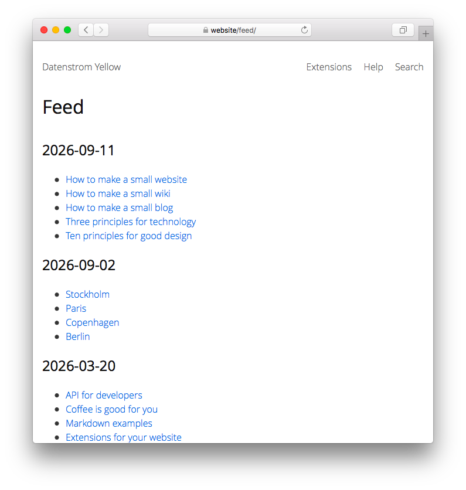

# Feed 1.0.2

Feed med senaste ändringarna. Utvecklad av Anna Svensson.

<p align="center"></p>

## Hur man installerar ett tillägg

[Ladda ner ZIP-filen](https://github.com/annaesvensson/yellow-feed/archive/refs/heads/main.zip) och kopiera den till din `system/extensions` mapp. [Läs mer om tillägg](https://github.com/annaesvensson/yellow-update/tree/main/readme-sv.md).

## Hur man använder en feed

Feeden finns tillgängligt på din webbplats som `http://website/feed/` och `http://website/feed.xml`. Den första länken är en mänskligt läsbar feed och den andra länken är en maskinläsbar feed, allmänt känt som en RSS feed. Det är en lista över senaste ändringarna på hela webbplatsen, endast synliga sidor ingår.

Om du inte vill att en sida ska synas, ställ in `Status: unlisted` i [sidinställningar](https://github.com/annaesvensson/yellow-core/tree/main/readme-sv.md#inställningar-page) högst upp på en sida.

## Hur man anpassar en feed

Om du inte vill lista hela webbplatsen i feeden, kan du använda olika filter för att anpassa feeden. Filtret `author:` visar sidor av en specifik författare. Filtret `language:` visar sidor på ett specifikt språk. Filtret `tag:` visar sidor med en specifik tagg. Filtret `folder:` visar sidor i en specifik mapp. Du kan också ändra typen av feed i inställningarna. För att skapa en bloggfeed öppna filen `system/extensions/yellow-system.ini` och ändra `FeedRecentChanges: blog`. För att skapa en wikifeed öppna filen `system/extensions/yellow-system.ini` och ändra `FeedRecentChanges: wiki, wiki-start`.

## Exempel

Innehållsfil med länk till feed:

    ---
    Title: Exempelsida
    ---
    Lorem ipsum dolor sit amet, consectetur adipisicing elit, sed do eiusmod tempor incididunt ut 
    labore et dolore magna pizza. Ut enim ad minim veniam, quis nostrud exercitation ullamco laboris 
    nisi ut aliquip ex ea commodo consequat. Duis aute irure dolor in reprehenderit in voluptate velit 
    esse cillum dolore eu fugiat nulla pariatur. Excepteur sint occaecat cupidatat non proident, sunt 
    in culpa qui officia deserunt mollit anim id est laborum.
    
    [Se senaste ändringarna](/feed/). 
    [RSS feed](/feed.xml).

Innehållsfil med länk till feed, av en specifik författare:

    ---
    Title: Exempelsida
    ---
    Lorem ipsum dolor sit amet, consectetur adipisicing elit, sed do eiusmod tempor incididunt ut 
    labore et dolore magna pizza. Ut enim ad minim veniam, quis nostrud exercitation ullamco laboris 
    nisi ut aliquip ex ea commodo consequat. Duis aute irure dolor in reprehenderit in voluptate velit 
    esse cillum dolore eu fugiat nulla pariatur. Excepteur sint occaecat cupidatat non proident, sunt 
    in culpa qui officia deserunt mollit anim id est laborum.

    [Se senaste ändringarna av Datenstrom](/feed/author:datenstrom/). 
    [RSS feed för Datenstrom](/feed/author:datenstrom/page:feed.xml).

Innehållsfil med länk till feed, med en specifik tagg:

    ---
    Title: Exempelsida
    ---
    Lorem ipsum dolor sit amet, consectetur adipisicing elit, sed do eiusmod tempor incididunt ut 
    labore et dolore magna pizza. Ut enim ad minim veniam, quis nostrud exercitation ullamco laboris 
    nisi ut aliquip ex ea commodo consequat. Duis aute irure dolor in reprehenderit in voluptate velit 
    esse cillum dolore eu fugiat nulla pariatur. Excepteur sint occaecat cupidatat non proident, sunt 
    in culpa qui officia deserunt mollit anim id est laborum.

    [Se senaste ändringarna för exempel](/feed/tag:exempel/). 
    [RSS feed för exempel](/feed/tag:exempel/page:feed.xml).

Innehållsfil med länk till feed, i en specifik mapp:

    ---
    Title: Exempelsida
    ---
    Lorem ipsum dolor sit amet, consectetur adipisicing elit, sed do eiusmod tempor incididunt ut 
    labore et dolore magna pizza. Ut enim ad minim veniam, quis nostrud exercitation ullamco laboris 
    nisi ut aliquip ex ea commodo consequat. Duis aute irure dolor in reprehenderit in voluptate velit 
    esse cillum dolore eu fugiat nulla pariatur. Excepteur sint occaecat cupidatat non proident, sunt 
    in culpa qui officia deserunt mollit anim id est laborum.

    [Se senaste ändringarna i hjälp](/feed/folder:help/). 
    [RSS feed för hjälp](/feed/folder:help/page:feed.xml).

Innehållsfil med olistad sida:

    ---
    Title: Olistad sida
    Status: unlisted
    ---
    Den här sidan är inte synlig i feeden.

Konfigurera olika typer av feed i inställningar:

```
FeedRecentChanges: auto
FeedRecentChanges: blog
FeedRecentChanges: blog, podcast, stream
FeedRecentChanges: wiki, wiki-start
```

## Inställningar

Följande inställningar kan konfigureras i filen `system/extensions/yellow-system.ini`:

`FeedLocation` = plats för feed  
`FeedXmlLocation` = plats för feed som maskinläsbart XML format  
`FeedPaginationLimit` = antal inlägg att visa per sida, 0 för obegränsad  
`FeedRecentChanges` = layouter att visa i feeden, `auto` för automatisk detektering, kommaseparerade  

Följande filer kan anpassas:

`system/layouts/feed.html` = layoutfil för feed  

Har du några frågor? [Få hjälp](https://datenstrom.se/sv/yellow/help/).
